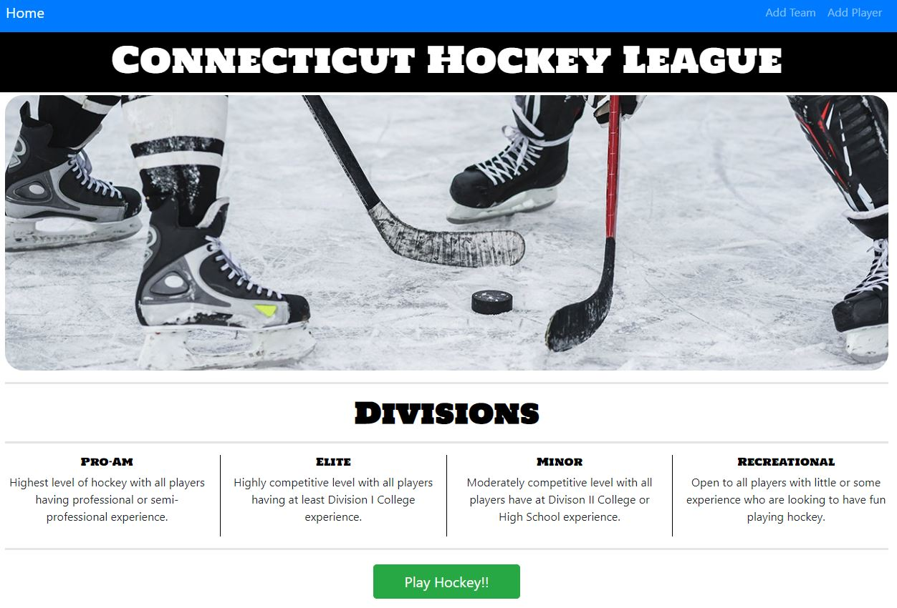
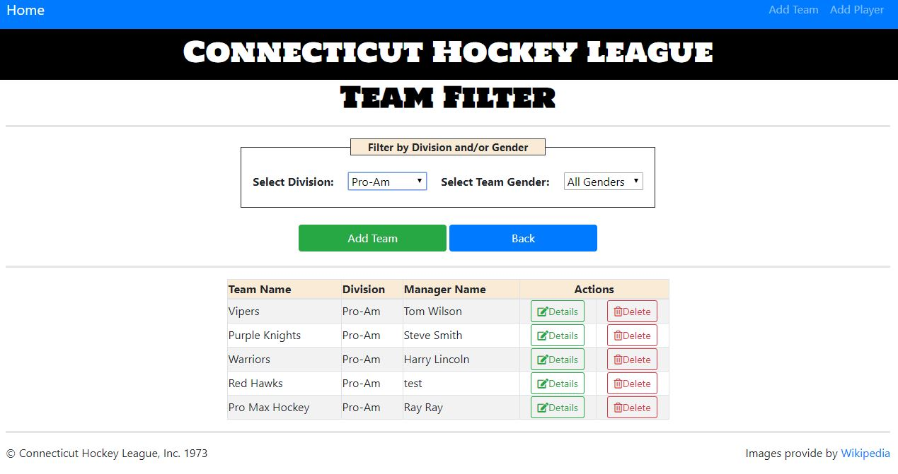
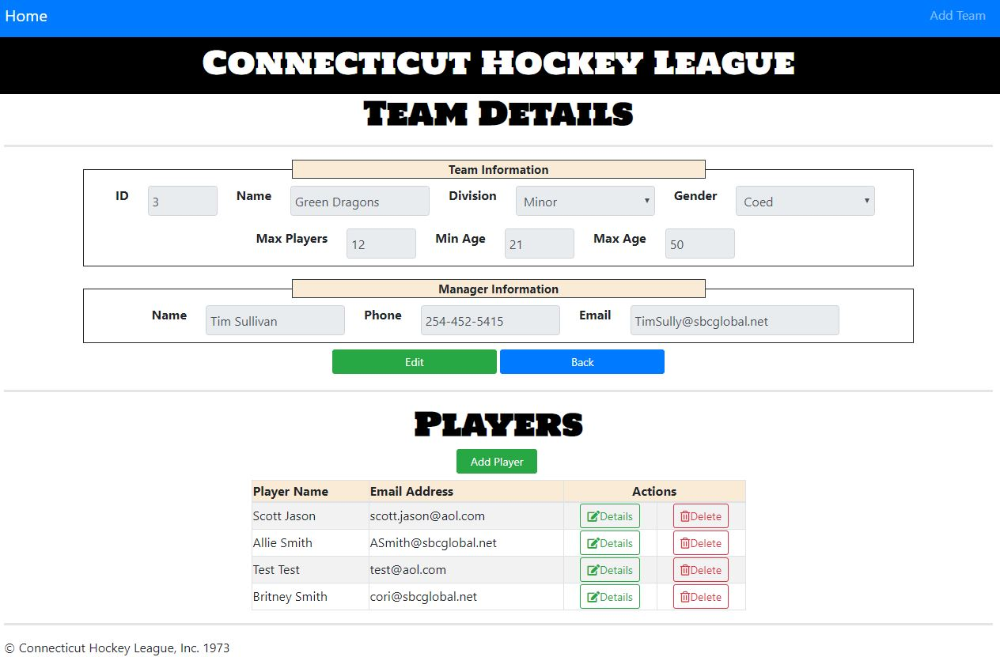
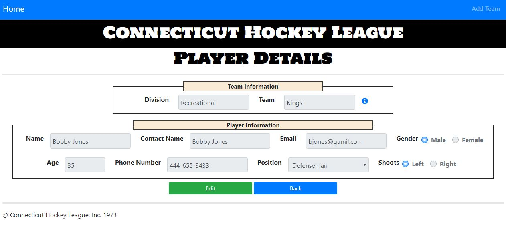
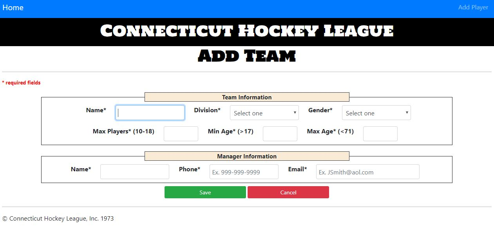
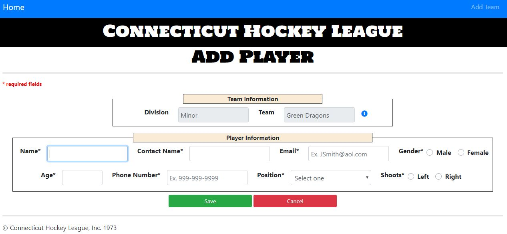
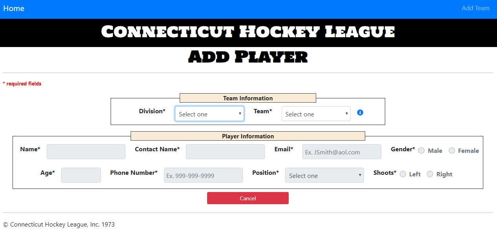

# Connecticut Hockey League (CHL)

## About

This site is allows a user to view all teams, edit teams, add teams, edit players and add players for the Connecticut Hockey League (CHL). 

Index page - Provides a description of each division available in the league and provides a button to get started, which the user will be directed to the filter teams page. There are also links on the navigation bar for Add Team and Add Player.

Filter Teams page - Provides a table list of all the Teams currently in the league. The user will have the ability to filter the list by Division and/or Team Gender. There is a button to add a team, as well as a button to see the details of a team and a button to delete the team from the league.

Details (Edit) Team page - Provides the details of the selected team as well as a list of players currently on the team. The user also has the ability to edit the team details by clicking the edit button (fields will become enabled). There is a button to add a team (if team is not full), as well as a button to see the details of a player and a button to delete the player from the team.

Details (Edit) Player page - Provides the details of the selected player. The user also has the ability to edit the player details by clicking the edit button (fields will become enabled). Provided to the user is a blue information icon, when clicked the user will see a popover with information about the team (Min Age, Max Age and Team Gender).

New Team page - Provides a form for the user to add a new team to the league. Once all information is entered and validated the team will be added to the selected division. Upon closing the success modal the user will be displayed the team details page for the team they just added.

New Player page - This page is navigated to by the link on the team details page. Provides the user the ability to add a player to the selected team. Once all information is entered and validated the player will be added to the selected team. Upon closing the success modal the user will be displayed the team details page where the new player will be displayed on the players table. Provided to the user is a blue information icon, when clicked the user will see a popover with information about the team (Min Age, Max Age and Team Gender).

New Player No Team page - This page is navigated to by the link on the navigation bar. Provides the user a form to add a player to any team that is not full. Once all information is entered and validated the player will be added to the selected team. Upon closing the success modal the user will be displayed the team details page where the new player will be displayed on the players table. Provided to the user is a blue information icon, when clicked the user will see a popover with information about the team (Min Age, Max Age and Team Gender).

## Audience
- Primary - Currently the site is setup for the admin of the site and anyone else who has the ability to add teams and/or players. Future upgrade will have access for anyone interested in playing, where they can register to play.

## Credits
- Content provided by [wiki](http://www.wiki.com)

# Setup
- Clone / Fork / Download Repo then run npm install.

## Execute the Following in your working dir
- npm install express --save
- npm install body-parser --save

## To Start/Stop a Specific Node Process
### To start server
- node server.js

### To stop server
- Ctrl + C
  
## Test App (Browser)
- Ensure Node Server is started!

http://localhost:8081/

## Reporting issues
Use Github's Issues section for this repository to report any issues with the notes.
Examples of the kind of issues that may need reporting:
- Typos
- Code samples not working as described
- Broken or moved links
- Etc.